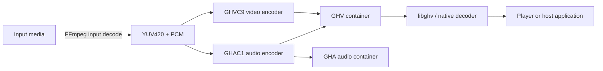

# GHV

**Goou_Zi High-efficiency Video**

[简体中文](README_CN.md)

GHV is an experimental open video and audio codec ecosystem focused on four
goals: **SMALL, CLEAR, FAST, STABLE**. The repository contains the project's
own GHVC video codec, GHAC audio codec, containers, native implementation,
development tools, specifications, compatibility tests, and measured benchmark
history.

> **Project status: Beta (`0.9.0-beta.1`).** GHV is not production-ready or an
> archival format. Bitstreams, APIs, performance, and tooling can still change
> before 1.0. Existing codec generations are kept decodable where practical.

## Design principles

- **Small:** improve real compression efficiency, not merely wrap another codec.
- **Clear / high quality:** do not trade severe visual or audio damage for size.
- **Fast:** encoding matters, and software decoding must retain realtime headroom.
- **Stable:** correct timestamps, seek, CRC, bounded memory, clean failure, and
  stable A/V playback are part of the format—not optional polish.

## Formats and codecs

| Name | Role | Current version |
|---|---|---:|
| **GHV** | Video/audio container and media system | 0.9 development |
| **GHVC** | GHV's native video codec | **GHVC9** encoder; GHVC4–9 decoders |
| **GHA** | Standalone audio container | 0.2 development |
| **GHAC** | GHV/GHA native audio codec | **GHAC1** |

GHVC and GHAC are implemented by this project. They are not H.264, HEVC, VP9,
AV1, Opus, or another external codec hidden behind a `.ghv`/`.gha` extension.
FFmpeg is used by conversion tools to read source media; it does not encode or
decode GHVC/GHAC.

The authoritative project, codec, Studio, Player, and library versions live in
[`VERSION.json`](VERSION.json). Run `python ghvversion.py` to inspect them.

## Current status

| Item | Status |
|---|---|
| Project version | **0.9.0-beta.1** |
| Current video codec | **GHVC9 Milestone 1** |
| Current audio codec | **GHAC1** |
| Native video compatibility | GHVC4, 5, 6, 7, 8, 9 |
| Primary verified platform | Windows 11 x64 |
| Linux/macOS | Native core build scripts exist; current milestone is not formally acceptance-tested there |
| Active focus | Codec compression, encoder RD cost, decoder reconstruction, robustness |
| Deferred | New player UI, Godot/MovieWriter, VLC/PotPlayer and other ecosystem integrations |

GHVC9 retains GHVC8's 16×16 local motion, median MV prediction, SKIP,
8×8 transform, quantization model, CRC, 64-bit index, and seek model. It adds a
predictor-ranked RD shortlist and independently decodable coefficient chunks
with capped-unary runs and signed Rice coding. See
[`SPEC_GHV_0.9.md`](SPEC_GHV_0.9.md).

## Latest verified benchmark

All rows below come from the same authoritative GHVC9 Milestone 1 suite:
Balanced preset, q78, GHAC1 HQ audio, complete native CRC verification, and
full quality measurement. Machine: Windows 11, Intel64 Family 6 Model 183,
20 logical cores. The installed RTX 4060 Ti was not used by the codec. FPS is
machine-specific and should not be treated as a universal hardware claim.

| Test | Source | GHVC9 output | Encode | Verified decode | PSNR / SSIM | Playback |
|---|---|---:|---:|---:|---:|---|
| A — compression/quality | 960×544, 30 fps, 127.4 s | **210.616 MiB** | **169.317 fps** | **913.114 fps** | 45.356 dB / 0.984213 | Visual PASS |
| B — 1080p stability | 1920×1080, 30 fps, 104.118 s | **405.317 MiB** | **52.810 fps** | **279.601 fps** | 46.628 dB / 0.990219 | PASS, 0 drops/freezes |
| C — 4K stress | 3840×2160, 24 fps, 181.348 s | **3062.501 MiB** | **11.196 fps** | **59.362 fps (2.473× realtime)** | 47.084 dB / 0.986903 | PASS, 0 drops/freezes |

Compared with the frozen GHVC8 baseline, GHVC9 reduces A/B/C size by
**27.12% / 26.82% / 24.97%**, while improving both measured encode and decode
speed. Test A is still about 4.66× the historical ~45.2 MB OGV reference, so
compression remains unfinished and the project does not claim to outperform
established codecs.

[Full GHVC9 benchmark report](benchmarks/GHVC9_MILESTONE1_2026-09-16.md) ·
[JSON reports](benchmarks/reports) ·
[Project state](PROJECT_STATE.md)

### Verified visual comparison

The frame below is one of the fixed 10/25/50/75/90% Test A checks. The complete
set is stored under `benchmarks/visual/ghvc9_m1_test_a`.


## Architecture



The decoder core returns timestamps and native YUV/PCM data. Playback timing is
handled separately with a fixed-rate audio master clock, bounded queues, and
late-video dropping; the codec does not slow or pitch-shift audio to hide a
slow video path.

## Included tools

- `ghvenc.py` / `ghaenc.py` — source-media conversion to GHV/GHA.
- `native/ghvcore.cpp` / `native/ghvdecode.cpp` — native GHVC encoder/decoder.
- `libghv/` — C++ decoder foundation with metadata, indexed seek, YUV and PCM.
- `GHV_Studio.bat` / `GHA_Studio.bat` — development desktop frontends.
- `GHV Player.exe` source — native Windows D3D11/WASAPI validation player.
- `ghvverify.py` — index, full decode, and reconstructed-frame CRC verification.
- `ghvrepair.py` — rebuild an index from intact frame records.
- `ghvdoctor.py` — decoder/playback throughput diagnostics.
- `ghvbench.py` — structured encode/decode/quality/profile benchmark reports.
- `ghvframes.py` — fixed-position source/decoded visual comparisons.

The Player and Studios are beta development tools. Ecosystem expansion is
currently paused while GHVC/GHAC mature.

## Requirements and build

Required for conversion:

- Python 3.10+
- FFmpeg and ffprobe
- Python packages from `requirements.txt`

Required for the native core:

- A C++17 compiler
- CMake for the full libghv/Player build
- OpenMP is optional but recommended

### Windows

```powershell
python -m pip install -r requirements.txt
native\build_windows.bat
```

For the full native library, tests, and Windows Player:

```powershell
cmake -S native -B native/build
cmake --build native/build --config Release
run_selftest.bat
```

Visual Studio Build Tools is the best-tested compiler path. `setup_windows.bat`
provides an interactive setup helper.

### Linux and macOS

`native/build_linux.sh` and `native/build_macos.sh` build the command-line native
core. These paths are maintained in source but have not received the current
Windows milestone's full A/B/C and playback acceptance pass.

## Usage

Encode video and embedded audio with the current Balanced GHVC9/GHAC1 path:

```powershell
python ghvenc.py input.mp4 output.ghv --codec 9 --preset balanced
```

Encode standalone audio:

```powershell
python ghaenc.py input.wav output.gha --mode hq
```

Inspect, verify, diagnose, or repair:

```powershell
python ghvinfo.py output.ghv
python ghvverify.py output.ghv
python ghvdoctor.py output.ghv --verify
python ghvrepair.py damaged.ghv repaired.ghv
```

Run a reproducible full benchmark:

```powershell
python ghvbench.py input.mp4 output.ghv --codec 9 --preset balanced --profile --quality-metrics --decode-frames 0 --report-json report.json
```

Use `--help` on each tool for the complete current CLI. Generated `.ghv`,
`.gha`, source videos, build trees, logs, and packages are intentionally ignored
by Git; small compatibility fixtures and benchmark summaries remain tracked.

## Specifications

- [GHV 0.9 / GHVC9](SPEC_GHV_0.9.md)
- [GHV 0.8 / GHVC8](SPEC_GHV_0.8.md)
- [GHV 0.7 / GHVC7](SPEC_GHV_0.7.md)
- [GHA 0.2](SPEC_GHA_0.2.md)
- [GHAC1 / GAUD historical specification](SPEC_GAUD_0.1.md)

Older specifications remain in the repository so decoder compatibility and
format evolution can be audited from the Git history.

## Versioning and development workflow

- Project releases use SemVer-style beta tags, such as `v0.9.0-beta.1`.
- Codec milestones use separate tags, such as `ghv-0.9-m1`.
- `main` is the latest tested public beta, not a claim of 1.0 stability.
- Active codec work happens on generation branches such as `codex/ghvc9`.
- A logical milestone is built, tested, committed, and pushed; GitHub history is
  the project's permanent development record.
- Existing stable recovery tags are immutable. GHVC8 remains recoverable at
  `ghv-0.8-stable-perf2`.

The 1.0 gate remains: competitive size without visible quality loss, efficient
software decode, stable 1080p/4K playback, robust seek/error behavior,
cross-platform reference decoding, and a complete public specification.

## Project documentation

- [Current project state](PROJECT_STATE.md)
- [Development and Git workflow](DEVELOPMENT.md)
- [Roadmap](ROADMAP.md)
- [Changelog](CHANGELOG.md)
- [GHVC8 recovery instructions](RESTORE_GHVC8_STABLE.md)
- [libghv API notes](LIBGHV_API.md)

## License

The reference implementation is licensed under the
[Apache License 2.0](LICENSE). No claim is made that an experimental codec is
free of all possible third-party patent claims in every jurisdiction.
